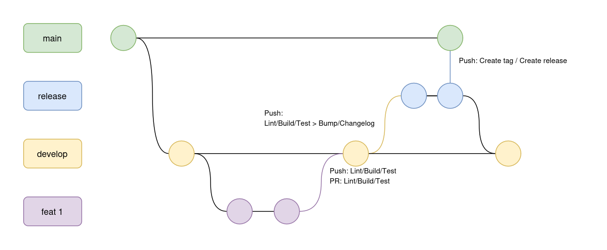

# Contribuindo com Terravision

Obrigado por contribuir com Terravision!

## 💅 Lint & Estilo de código

Esse repositorio utiliza lint para boas práticas e padronização de código.

**Pacote:** [Checkstyle](https://checkstyle.sourceforge.io/)
**Execução source files:** `./gradlew checkstyleMain`
**Execução test files:** `./gradlew checkstyleTest`

## 🧪 Testando

**Pacote:** [Spring Boot Starter Test](https://docs.spring.io/spring-boot/docs/1.5.7.RELEASE/reference/html/boot-features-testing.html)
**Execução**: `./gradlew test`

## 👨‍💻 Ambiente de desenvolvimento

Para preparar o ambiente de desenvolvimento, [siga essas instruções](https://github.com/MarcyLeite/fatec-api-4/blob/main/.github/CONTRIBUING.md#-development-environment).

### Scripts

| Script | Execução | Descrição |
| ----- | ---- | --- |
| Reset DB | ./scripts/resetDB.sh | Deleta as tabelas do banco e executa os scripts de migração em `resources/db/migration` |

## 👷 CI/CD

- Lint/Build/Test: Executa esses comandos em ordem e retorna erro em caso de falha;
- Bump/Changelog: Analiza os commits feitos, gera um changelog baseado no [Semantic release gitmoji](https://github.com/momocow/semantic-release-gitmoji) e atualiza a versão no arquivo `gradlew.build`. Essas mudanças são enviadas para a branch logo em seguida;
- Create tag/Create release: Cria uma tag git com a versão atualizada e uma release no github usando o changelog como descrição.